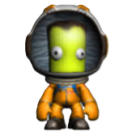
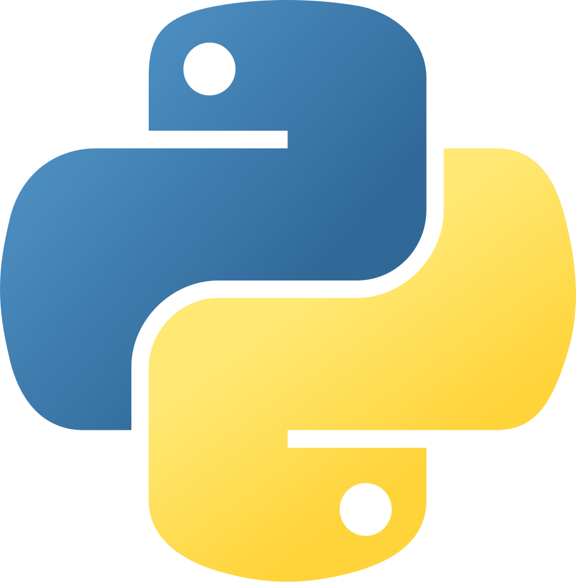
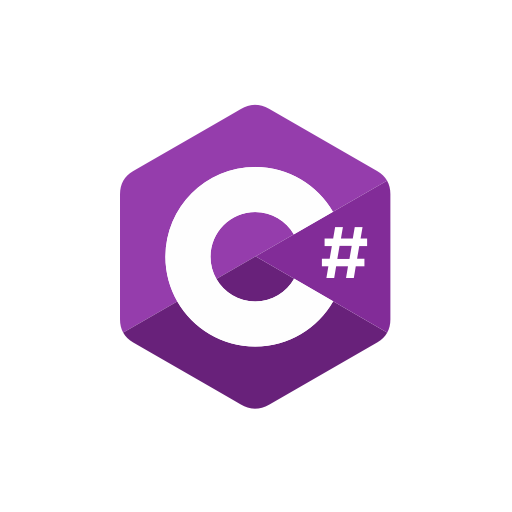
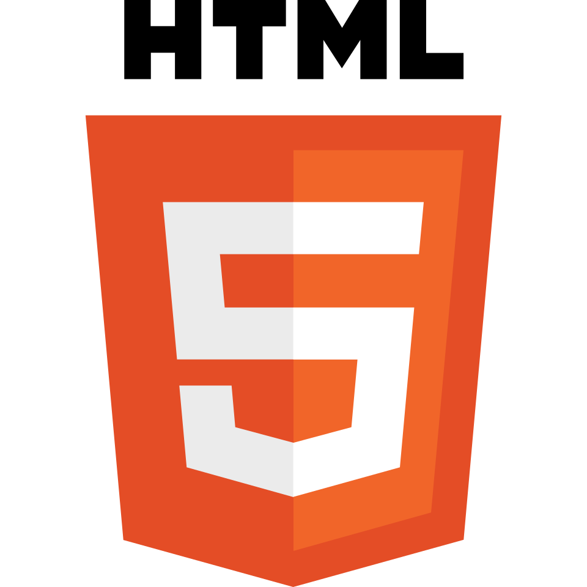
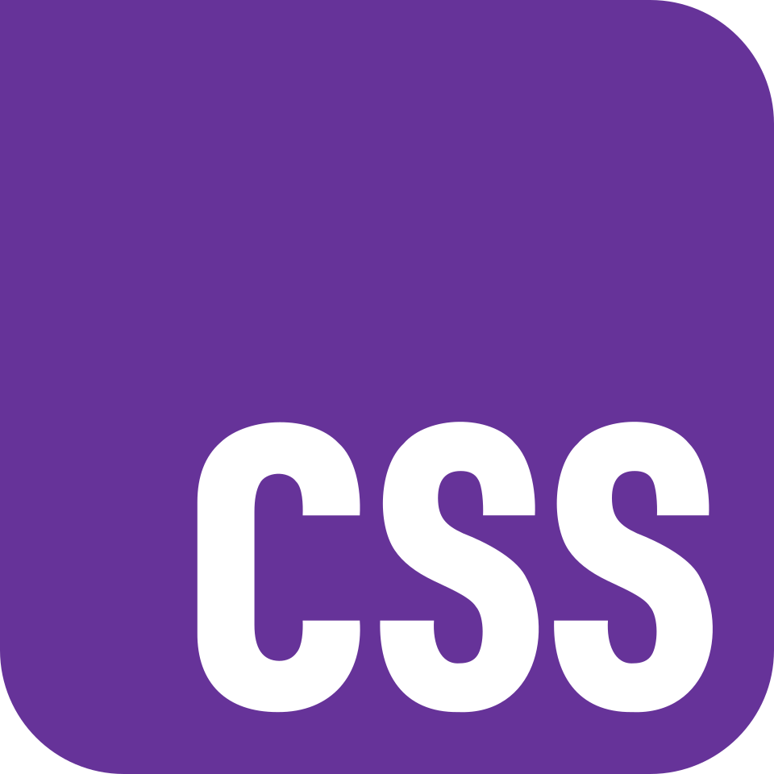
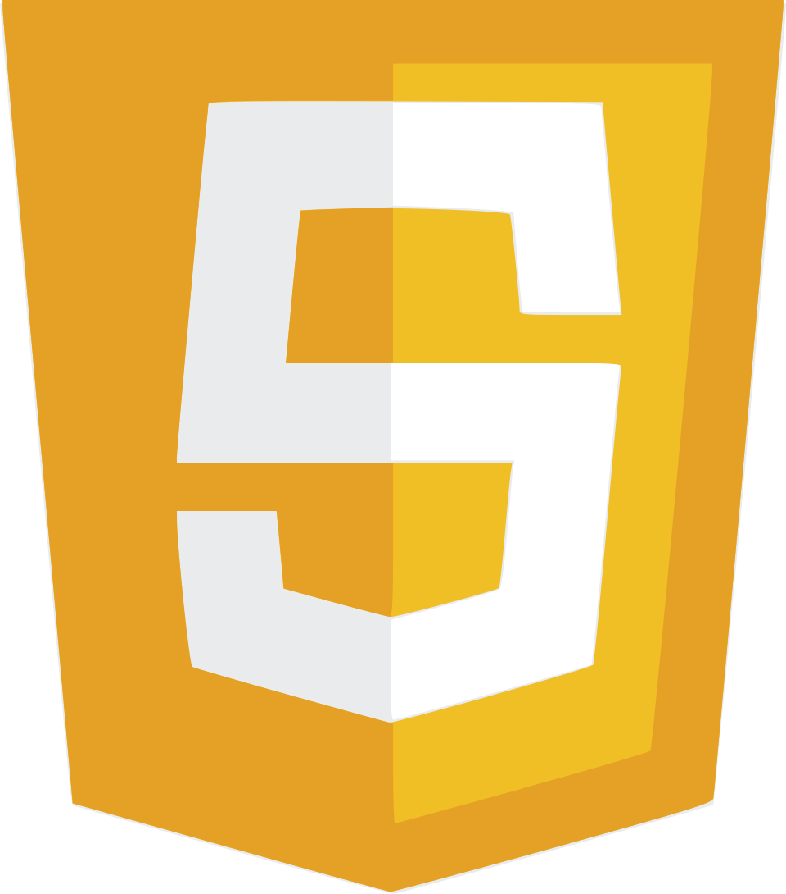

# Astra

I build random projects that are fun, useful, and sometimes way too ambitious. Most of my work revolves around **Kerbal Space Program**, UI design, and open-source experiments.

## My favorite games

  
  

## Languages I'm (not) learning

  
  
  
  
  

I build KSP tools, KerboScript projects, UI experiments, and random open-source projects.

> *Building cool stuff one project at a time.*
